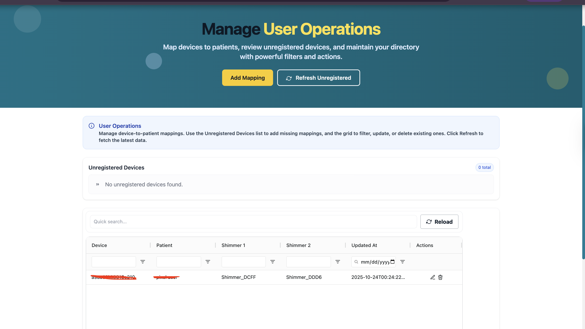
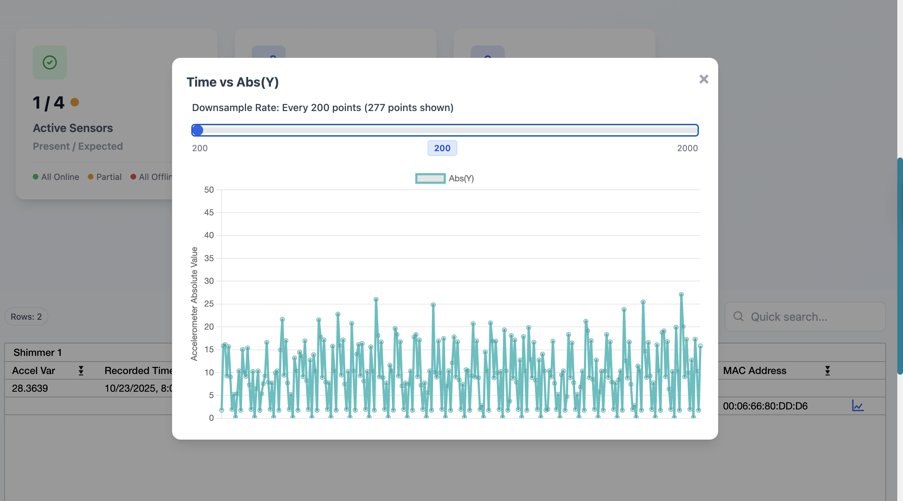

# Shimmer Sensor Dashboard
Angular-based web application for managing and visualizing Shimmer wearable sensor data. Features interactive time-series charts, data grid tables, and real-time device-patient mapping with AWS S3 integration.

## Features

- **Interactive Data Grid**: AG Grid implementation for displaying device and patient metadata with sorting, filtering, and pagination
- **Time-Series Visualization**: Chart.js integration for plotting accelerometer data from Shimmer sensors
- **Device-Patient Mapping**: Interface for associating devices with patients
- **Real-Time Data**: Live updates from S3-backed sensor data storage
- **Responsive UI**: Modern, mobile-friendly interface built with Tailwind CSS
- **AWS Integration**: Deployed on AWS Amplify with S3 storage backend

## Tech Stack

- **Framework**: Angular 20.1.6
- **UI Components**: AG Grid, Tailwind CSS
- **Charts**: Chart.js, ng2-charts
- **Backend**: AWS Amplify (v22.x), AWS S3
- **Language**: TypeScript
- **Package Manager**: npm

## Prerequisites

- Node.js (v18 or higher recommended)
- npm (v9 or higher)
- Angular CLI (`npm install -g @angular/cli`)

## Installation

1. Clone the repository:
```bash
git clone https://github.com/shimmerumass/shimmer-sensor-dashboard.git
cd shimmer-sensor-dashboard
```

2. Install dependencies:
```bash
npm install
```

3. Configure AWS Amplify (if deploying):
```bash
amplify configure
```

## Development

To start a local development server, run:

```bash
ng serve
```

Navigate to `http://localhost:4200/`. The application will automatically reload when you modify source files.

## Building

Build the project for production:

```bash
ng build
```

Production build artifacts will be stored in the `dist/` directory with optimizations enabled.

To build with specific configuration:
```bash
ng build --configuration production
```

## Key Components

### Data Grid Component
Displays Shimmer sensor metadata with:
- Patient and device information
- Timestamp data
- Accelerometer variance values
- Graph visualization buttons for Shimmer 1 and Shimmer 2 sensors

### Home Page Component
Main dashboard featuring:
- Active sensor count (unique devices with data)
- Total data points statistics
- Unregistered devices count
- User count
- Interactive charts modal for time-series visualization
- Device-patient mapping interface

### API Service
Handles data fetching from backend:
- `listFilesMetadata()`: Basic file metadata (device, date, patient, files)
- `listFilesCombinedMeta()`: Complete metadata with decoded sensor data
- `listUniquePatients()`: Patient list for mapping
- `listFilesDeconstructed()`: Parsed file structure

### Latest File Per Device Page
Displays the most recent file received for each Shimmer device:
- **Purpose:** Quickly view the latest data file uploaded by each device, including timestamp and file details.
- **Location:** Accessible from the main dashboard navigation ("Latest Files" link).
- **Features:**
  - Card-based layout matching other management pages
  - Responsive table listing device ID, file name, and received time
  - Updated automatically as new files arrive
- **How to Use:**
  1. Click "Latest Files" in the navigation bar.
  2. View the most recent file for each device in the table.
  3. Use this page to monitor device activity and data freshness at a glance.

**Note:** This page uses the `/files/deconstructed/` API endpoint to fetch and display the latest file for each device.

### Dashboard Page (Daily Aggregated Shimmer Data)
Displays daily aggregated Shimmer sensor data with comprehensive statistics and visualization:
- **Purpose:** View daily aggregated data files grouped by date, device, and patient, with detailed statistics for each Shimmer sensor.
- **Location:** Accessible from the main navigation ("Dashboard" link) or as the default page after login.
- **Features:**
  - Hero section with "Welcome to COSDA" branding
  - Statistics cards showing:
    - Active Sensors (present/expected count)
    - Data Points (total count and recent percentage)
    - Users count
  - Data grid displaying:
    - Date, Patient, Device
    - Shimmer1 and Shimmer2 assignments
    - Shimmer1 and Shimmer2 file names
    - Actions column with "View" and "Files by Hour" buttons
  - Chart modal with:
    - Tabs for Shimmer1 and Shimmer2
    - Line chart for acceleration data visualization
    - Statistics display (Mean, Max, Min, UWB Non-Zero Count, Accel Points)
    - Download button for combined data files
    - Export chart as PNG
  - Quick search functionality
  - "View Files by Hour" link in Data Points card
- **How to Use:**
  1. Navigate to Dashboard from the header or it will load automatically after login.
  2. View aggregated data in the grid, sorted by date.
  3. Click "View" button to see detailed charts and statistics for a specific day.
  4. Click "Files by Hour" to navigate to the home page filtered by that date.
  5. Use quick search to filter across all columns.
- **API Endpoints:**
  - `GET /combined-data-files/` - Fetches all combined data files
  - `GET /get-combined-data-file/?filename=...` - Gets detailed file information
  - `GET /get-combined-data-field/?filename=...&field_name=...` - Gets specific field data for charting

### Daily Aggregator Page
Manages daily data aggregation and combined data files:
- **Purpose:** Trigger daily aggregation processes and view combined data files from S3.
- **Location:** Accessible from the main navigation ("Daily Aggregator" link).
- **Features:**
  - **Daily Aggregation Section:**
    - Date input (optional) - Enter specific date or leave empty for automatic processing
    - "Trigger Aggregation" button to start the aggregation process
    - Result display showing aggregation status and details
    - Error handling with clear error messages
  - **Load Combined Data Files Section:**
    - Optional date filter for viewing files from a specific date
    - "Load Files" button to fetch combined data files from S3
    - Data grid displaying:
      - Date, Patient, Shimmer1, Shimmer2
      - Shimmer1 File and Shimmer2 File names
    - Quick search functionality
    - Row count display
- **How to Use:**
  1. Navigate to Daily Aggregator from the header.
  2. **To trigger aggregation:**
     - Optionally enter a date (YYYY-MM-DD) or leave empty for automatic processing
     - Click "Trigger Aggregation" button
     - View the result in the success message
  3. **To view combined data files:**
     - Optionally enter a date to filter files
     - Click "Load Files" button
     - View results in the data grid below
     - Use quick search to filter the results
- **API Endpoints:**
  - `POST /daily-aggregator/` - Triggers daily aggregation (with optional date in body)
  - `GET /combined-data-files/` - Fetches combined data files (with optional date query parameter)

## Configuration

### Angular Build Budgets
Current production bundle size limits (configured in `angular.json`):
- Initial bundle warning: 3 MB
- Initial bundle error: 4 MB

### Environment Variables
Configure API endpoints in `src/environments/`:
- `environment.ts` (development)
- `environment.prod.ts` (production)

## Deployment

### AWS Amplify
The application is configured for AWS Amplify deployment:

1. Connect your repository to Amplify Console
2. Configure build settings (amplify.yml is included)
3. Deploy automatically on push to main branch

### Manual Deployment
Build and deploy to any static hosting:
```bash
ng build --configuration production
# Deploy contents of dist/ directory
```

## Common Issues

### Bundle Size Warnings
If you encounter bundle size errors during build, adjust budgets in `angular.json`:
```json
"budgets": [
  {
    "type": "initial",
    "maximumWarning": "3mb",
    "maximumError": "4mb"
  }
]
```

### Lock File Sync Issues
If `package-lock.json` is out of sync:
```bash
npm install
git add package-lock.json
git commit -m "Update package-lock.json"
```


### Chart Downsampling and Data Size

Sensor data files can contain tens of thousands of time-series points (e.g., 55,000+ records). To ensure smooth chart rendering and better user experience, the dashboard uses **downsampling** in the chart modal:

- **Original Size**: The modal displays the total number of points available (original size) for each file.
- **Downsampling**: A slider lets users select the downsampling rate (e.g., every 200th, 250th, ... up to 2000th point). This reduces the number of points plotted, making large datasets manageable and interactive.
- **Live Preview**: The chart updates in real time as the slider is adjusted, showing the number of points currently displayed.
- **Preserves Trends**: Downsampling keeps the overall shape and trends of the data while improving performance.

**Tip:** If the chart looks sparse or too dense, adjust the slider to find the best balance between detail and speed. The original data size is always shown for reference.

## Data Flow

1. **Metadata Loading**: API fetches combined metadata from S3 backend
2. **Grid Display**: Data is processed and displayed in AG Grid with Shimmer 1/2 columns
3. **Graph Visualization**: Clicking graph button emits time-series data to parent component
4. **Chart Rendering**: Modal opens with Chart.js rendering the time vs acceleration data

## Contributing

1. Fork the repository
2. Create a feature branch (`git checkout -b feature/amazing-feature`)
3. Commit your changes (`git commit -m 'Add amazing feature'`)
4. Push to the branch (`git push origin feature/amazing-feature`)
5. Open a Pull Request

## License

This project is licensed under the MIT License - see the [LICENSE](LICENSE) file for details.

This project is part of the UMass Shimmer research initiative.

## Contact

For questions or support, please contact the UMass Shimmer team.

## About AWS Amplify

AWS Amplify is a set of tools and services that enables developers to build secure, scalable full-stack applications powered by AWS. In this project, Amplify is used for deployment, authentication, and integration with AWS S3 for sensor data storage.

**Key Amplify Features in This Project:**
- **Deployment:** Automatic builds and deployments via Amplify Console. The `amplify.yml` file defines build settings for CI/CD.
- **Authentication:** User authentication flows are managed by Amplify, as configured in the `amplify/auth` directory.
- **Storage:** Sensor data is stored and accessed through AWS S3, managed by Amplify's backend configuration.
- **Configuration:** The `amplify/` directory contains CLI and backend configuration files for resources and environment settings.
- **Integration:** The Angular app uses Amplify libraries to interact with AWS services, supporting real-time updates and secure data access.

**Deployment Workflow:**
1. Connect your repository to Amplify Console.
2. Configure build settings (see `amplify.yml`).
3. Push changes to trigger automatic deployment and backend updates.

For more information, see the [AWS Amplify Documentation](https://docs.amplify.aws/).


## Screenshots

**Dashboard Overview:**


**Bulk Data Management:**


**User Operations:**


**Accelerometer Chart Modal with Downsampling:**



## Additional Resources

- [Angular CLI Documentation](https://angular.dev/tools/cli)
- [AG Grid Documentation](https://www.ag-grid.com/angular-data-grid/)
- [Chart.js Documentation](https://www.chartjs.org/docs/)
- [AWS Amplify Documentation](https://docs.amplify.aws/)
